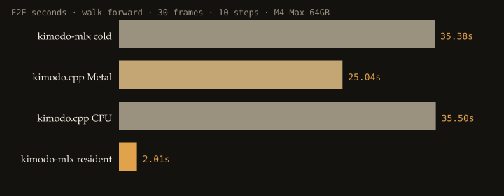
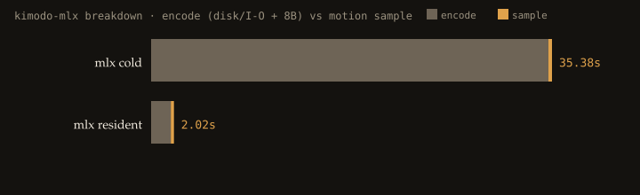

# kimodo-mlx

An MLX/Metal port of NVIDIA Kimodo for Apple Silicon. It does not use the Neural Engine.

The numbers below are from one machine: a Mac Studio M4 Max with 64 GB, prompt `walk forward`, 30 frames, 10 DDIM steps, seed 42. kimodo.cpp Metal streams transformer layers from disk. kimodo-mlx keeps the 15 GB LLM2Vec bundle in unified memory after the first encode.

[Motion comparison](docs/compare.html) · [Raw timings](evidence/compare/timings.json)

## Measurements





| Runtime | Weights resident | Encode | Sample | E2E |
| --- | --- | --- | --- | --- |
| kimodo-mlx Metal, cold | no | 35.05s | 325ms | 35.38s |
| **kimodo-mlx Metal, resident** | **yes** | **1.74s** | **277ms** | **2.01s** |
| kimodo.cpp Metal | no (layer streaming) | — | — | 25.04s |
| kimodo.cpp CPU | no | — | — | 35.50s |
| ONNX Runtime / CoreML | — | — | — | not run (no graph) |
| NVIDIA Kimodo PyTorch MPS | — | — | — | not run (gated Llama 3 encoder) |

A shorter clip (16 frames / 8 steps) measured **0.93s** mean E2E for resident MLX versus **37.0s** for cpp Metal. LLM2Vec cosine versus `kmd-encode` is > 0.99. Joint-position MAE is 0.107 m against cpp Metal on the same seed; the RNGs that draw the initial noise are not the same.

**Takeaway:** a one-shot cold start still favors cpp Metal. Once the process is warm, MLX is about **12×** faster. That gap is memory residency of the 8B encoder, not a faster denoiser kernel. On a 16 GB Mac the resident path is the wrong trade; cpp streaming is.

## What this port covers

- Bidirectional LLM2Vec on Llama-3-8B (a causal llama.cpp embedding is not compatible)
- Two-stage transformer motion denoiser + DDIM
- NVIDIA SOMA safetensors or LocalAI F32 GGUF
- Metal GPU only. ANE, Core ML, and ONNX are not in this release.

## Quick start

Weights are not in git. Read the NVIDIA Open Model License and the Meta Llama 3 terms before downloading. Built with Meta Llama 3.

```sh
uv venv --python 3.12 .venv
uv pip install --python .venv/bin/python -e ".[dev]"
hf download nvidia/Kimodo-SOMA-RP-v1.1 --local-dir models/nvidia-soma-rp-v1.1
hf download LocalAI-io/Llama-3-Kimodo-GGML --local-dir models/llm2vec-text-bundle
.venv/bin/python -m kimodo_mlx diagnose
.venv/bin/python -m kimodo_mlx generate \
  --prompt "walk forward" \
  --motion models/nvidia-soma-rp-v1.1 \
  --text models/llm2vec-text-bundle/generated/llm2vec-text-bundle \
  --frames 30 --steps 10 --seed 42
```

`diagnose` should report `mlx-metal` and `neural_engine_used: false`.

## Benchmarks

```sh
PYTHONPATH=. .venv/bin/python scripts/capture_comparison.py
PYTHONPATH=. .venv/bin/python scripts/build_compare_html.py
open docs/compare.html
```

kimodo.cpp Metal baseline:

```sh
sh scripts/build_kimodo_metal.sh
```

## Tests

```sh
PYTHONPATH=. .venv/bin/python -m pytest -q
```

## License

Code is MIT (`LICENSE`). Model weights stay under NVIDIA / Meta Llama 3 / LocalAI terms. Do not redistribute SMPL-X RP derivatives. See `ATTRIBUTION.md`.

Hardware snapshot: macOS 26.5.1, Apple M4 Max, 64 GB, Python 3.12.9, MLX 0.32, kimodo.cpp `568b0253`.
